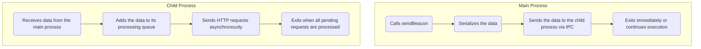

<div align="center">

# `node-beacon`

</div>

A Node.js library that provides a sendBeacon function, mirroring the behavior of the Web `navigator.sendBeacon()` API. It allows you to send asynchronous, non-blocking HTTP requests from Node.js, ensuring that all pending requests are sent even if the main process exits.


## Features

 - **Asynchronous and Non-Blocking:** Sends data without blocking the main thread.
 - **Process-Resilient:** Ensures that all pending requests are sent even if the main process exits immediately.
 - **Minimal Main Thread Overhead:** Offloads processing to a detached child process.
 - **API Compatible:** Mimics the Web `navigator.sendBeacon()` API for seamless integration.
 - **Supports Multiple Data Types:** Handles strings, ArrayBuffers, Blobs, and more.
 - **No Global Pollution:** Does not override or modify any global functions or objects.

## Installation

Install the package via npm:

```bash
npm install node-beacon
```

## Usage

### Basic Example

```ts
// Import the sendBeacon function
const { sendBeacon } = require('node-beacon');

// URL to send data to
const ECHO_SERVER_URL = 'http://localhost:3000';

// Data to send
const data = JSON.stringify({
  event: 'userLogout',
  timestamp: new Date().toISOString(),
});

// Send the beacon
const success = sendBeacon(ECHO_SERVER_URL, data);

if (!success) {
  console.error('Failed to queue the beacon request.');
}

// Exit the main process immediately
process.exit(0);

// Any code here will not execute
console.log('This will not be printed');
```

**Explanation:**
 - The `sendBeacon` function queues the data to be sent to the server.
 - The main process exits immediately using `process.exit(0)`.
 - The detached child process continues running, sends the pending request, and exits gracefully afterward.

### Sending Different Data Types

The sendBeacon function supports various data types similar to the Web API.

#### Sending a String

```ts
sendBeacon('https://example.com/api', 'Plain text data');
```

#### Sending JSON Data

```ts
const jsonData = JSON.stringify({ key: 'value' });
sendBeacon('https://example.com/api', jsonData);
```

#### Sending URLSearchParams

```ts
const { URLSearchParams } = require('url');

const params = new URLSearchParams({ key1: 'value1', key2: 'value2' });
sendBeacon('https://example.com/api', params);
```

#### Sending a Blob

```ts
const { Blob } = require('buffer');

const blobData = new Blob(['Hello, world!'], { type: 'text/plain' });
sendBeacon('https://example.com/api', blobData);
```

## API

```ts
sendBeacon(url, data)
```

Sends data to the specified URL asynchronously and non-blockingly.

**Parameters**
 - url (`string`): The URL to send data to.
 - data (optional): The data to send. Can be one of the following types:
    - `string`
    - `ArrayBuffer`
    - `ArrayBufferView` (e.g., `Uint8Array`)
    - `Blob` (from the buffer module)
    - `URLSearchParams`
    - `Buffer`

**Return Value**
 - (`boolean`): Returns true if the data was successfully queued for sending, false otherwise.

## Usage Example

```ts
const success = sendBeacon('https://example.com/api', 'Sample data');

if (!success) {
  console.error('Failed to queue the beacon request.');
}
```

### How It Works

 - **Detached Child Process:** The library uses a detached child process to handle the sending of beacon requests. This process continues running even if the main process exits.
 - **Inter-Process Communication (IPC):** The main process sends data to the child process via IPC messages.
 - **Queue Management:** The child process maintains a queue of pending requests and processes them asynchronously.
 - **Graceful Exit:** After processing all pending requests, the child process exits automatically.



## Limitations

 - **No Response Handling:** The sendBeacon function is designed for _“fire-and-forget”_ scenarios and does not provide mechanisms to handle server responses.
 - **Data Size Limitation:** Designed for small amounts of data (recommended maximum is _64 KB_).
 - **FormData Not Supported:** Due to Node.js limitations, FormData is not supported.
 - **Error Handling:** Errors in sending requests are logged to the console in the child process but are not propagated back to the main process.

## Advanced Usage

### Immediate Process Exit
Even if the main process exits immediately after calling `sendBeacon`, the library ensures that the pending requests are sent.

```ts
const { sendBeacon } = require('node-beacon');

sendBeacon('http://localhost:3000', 'Data before exit');

// Exit immediately
process.exit(0);
```

## Contributing

Contributions are welcome!

## License

This project is licensed under the MIT License.

---

Inspired by the need to have a reliable sendBeacon functionality in Node.js environments, similar to the Web API.

---

<div align="center">

Made with ❤️ by [Rajaniraiyn](https://github.com/rajaniraiyn)

</div>